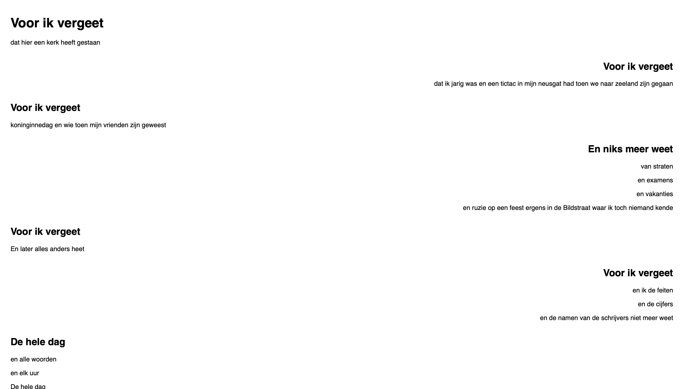

Het staat model voor digitale tuintjes welke bij 'Het web is voor iedereen' door studenten worden gemaakt.

## Learning Log

### [...]

[...]

### 3 sept - [Workshop]

[...]

### 31 aug - Kickoff

21 AUG

Een fork van de model repository gemaakt en gepubliceerd via mijn eigen Github omgeving.
Leg uit wat een source hosting platform is en voor welke jij gekozen hebt.
--> Een source hosting platform is een plaats waar je je code kan managen en delen, ik heb zelf gekozen voor github

Vertel welke domeinnaam jij gekozen hebt en hoe je die hebt gekoppeld aan jouw pagina.
--> Ik heb voor Lysannescorner gekozen en ik heb dit gekoppeld via de respitory

Beschrijf hoe je aanpassingen aan jouw pagina kunt maken en hoe je er voor zorgt dat die op het web gepubliceerd worden.
-->Je kan via Visual Studio code aanpassingen maken

2 SEP

Ik ben bij 2 deepdives geweest en heb mijn website werkend gemaakt (je kan het nu intypen en dan is hij er ook) en een gif toegevoegd. Ook heb ik de lokkaart in Figma uitgewerkt voor een iPad.

4 SEP
Ik heb een achtergrondkleur en een paar vakjes aan mijn site toegevoegd en de opdrachten van de lettertypes gemaakt van de deepdives.

7 SEP
Ik heb vandaag op school verschillende websites bezoekt en gebruikt als eventuele inspiratie voor mijn website en een artikel over de geschiedenis van digital Gardens

10sep

<<<<<<< HEAD

? sep
Weet niet precies wanneer dit was maar het was ergens hiertussen en ik heb visueel onderzoek gedaan naar mijn onderwerp

11 SEP
Ik heb aan een van de deepdives meegedaan en hiervan de opdrachten gemaakt

13 SEP
Ik heb vandaag onderzoek gedaan naar mijn eerste 2 dieren en de astronaut en dieren getekent en in mijn code gezet. Ik heb de bounce animatie voor elk element sneller/langzamer gemaakt en mooier gemaakt. Ik heb geprobeerd een textbox toe te voegen als je op een dier klikt maar dit is nog niet gelukt.

28 sep
Ik heb mijn learning log lang niet meer bijgehouden en ik ben ook veel van mijn foto's kwijt omdat mijn telefoon kapot is gegaan. Ik heb in deze tijd een nieuw dier toegevoegd, ik had eerst pagina's met informatie en dit heb ik naar popovers veranderd zodat je niet uit de ervaring word gehaald en ik heb een light en dark mode toegevoegd.

f# Model

30SEP
Ik heb mijn zinkende koekje voor mijn cookie pop up clickable gemaakt en voor elke popover een kruisje toegevoegd. Ik heb de anglerfish en de phantom jellyfish getekend.

1 OKT
Ik heb een overlay toegevoegd aan mijn site om alles bij elkaar te laten passen en het iets minder kleur te geven wat ook bij de diepzee past, ik heb de cookie mooi gemaakt (de pop up zelf moet ik nog fixen.) En mijn bigfinsquid mooier gemaakt zodat het meer bij de stijl van de rest van mijn site past. Ook heb ik mijn anglerfish iets realistischer gemaakt kwa shading maar die zet ik er straks nog in.

2 OKT
ik heb feedback van sanne gekregen en ik moet mijn columns en rows aanpassen, accesibitliy testen en zorgen dat alle elementen van mijn site responsive zijn en mobile first is.

5 OKT
Intro gekregen songtekst opdracht, liejde gekozen (ik heb voor ik vergeet va spinvis gekozen) schetsen gemaakt en de songtekst een beetje geanalyseerd.

Check-out
Leg uit wat er met de volgende termen bedoeld wordt: kerning, tracking, leading, flush-left, flush-right, centered, justified, indent, outdent, modular scale, movable type, focus punt, vijf soorten contrast, spatial tension. (Hint, alle termen staan in de artikelen die we samen gelezen hebben)

Wat is jouw ideale regellengte (measure)? Leg uit waarom.

Als je in een ontwerp maar één variabele tot je beschikking had om hiërarchie aan te brengen (grootte, plaatsing, spacing, lettersoorten), welke zou je dan gebruiken en waarom?

6 OKT
Eerste versie in css uitgewerkt

7 OKT
Check-out

Waarom is het goed om een grid in je ontwerp toe te passen? Noem een reden voor de ontwerper en een voor de bezoeker.
Noem drie manieren om chaos in je ontwerp te voorkomen.
Hoeveel gekkigheid moet er in je werk zitten?
